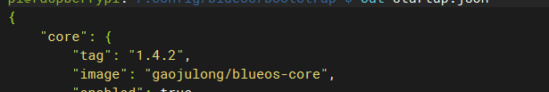

# BlueOS

[](https://github.com/bluerobotics/BlueOS/actions/workflows/test-and-deploy.yml)


[
](https://github.com/bluerobotics/blueos/releases/latest)

[
](https://github.com/bluerobotics/BlueOS/releases)

[

](https://hub.docker.com/r/bluerobotics/blueos-core/tags)

### 注意事项

- 使用git clone拉去仓库、git bash工具提交、vscode修改文件，否则在window平台可能会更改.sh的脚本权限，导致无法自动部署

- 在仓库中配置Docker用户名和密码


### 将80端口改为2770

core/tools/nginx/nginx.conf - 将nginx服务器的监听端口从80改为2770

~~~
# 47行
    server {
        listen 2770; # IPv4
        listen [::]:2770; # IPv6
~~~


core/services/beacon/default-settings.json - 将HTTP服务发现端口从80改为2770

~~~
36行
      {
        "name": "_http",
        "protocol": "_tcp",
        "port": 2770
      }
~~~


install/network/blueos.service - 将Avahi服务发现配置中的HTTP端口从80改为2770

~~~
# 8行
    <port>2770</port>
~~~


core/services/helper/main.py - 将SKIP_PORTS中的BlueOS端口从80改为2770

~~~
    SKIP_PORTS: Set[int] = {
        22,  # SSH
        2770,  # BlueOS
        5201,  # Iperf
        6021,  # Mavlink Camera Manager's WebRTC signaller
        7000,  # Major Tom does not have a public API yet
        8554,  # Mavlink Camera Manager's RTSP server
        5777,  # ardupilot-manager's Mavlink TCP Server
        5555,  # DGB server
        2770,  # NGINX
    }
~~~


### 修改core中的启动备份固件

- 修改检测端口为2770

  ~~~
  # blueos-self/bootstrap/bootstrap/bootstrap.py
  
  response = requests.get("http://localhost:2770/version-chooser/v1.0/version/current", timeout=10)
  ~~~

- 修改启动备份固件

  ~~~
  # bootstrap/startup.json.default
  
          "tag": "master",
          "image": "gaojulong/blueos-core",
          "enabled": true,
          "webui": false,
          "network": "host",
  ~~~

  

### 修改mav2r


### 在系统中安装新版固件和常用库和依赖

~~~
sudo apt-get install vim 

~~~


**配置docker代理**

~~~
sudo mkdir -p /etc/systemd/system/docker.service.d/
sudo vim /etc/systemd/system/docker.service.d/http-proxy.conf
~~~

**内容如下：**

~~~
[Service]
Environment="HTTP_PROXY=http://127.0.0.1:10808/"
Environment="HTTPS_PROXY=http://127.0.0.1:10808/"
~~~

**重启**

~~~
sudo systemctl daemon-reload
sudo systemctl restart docker
~~~

**配置DHCP防止容易启动失败时断开与树莓派的联系**

~~~shell
sudo nano /etc/dhcpcd.conf
~~~

**在文件中添加配置信息**

~~~tex
interface eth0
static ip_address=192.168.2.2/24
static routers=192.168.2.1
~~~

**重启dhcp**

~~~shell
sudo service dhcpcd restart
~~~

**删除原有的镜像**

~~~
docker stop blueos-bootstrap
docker rm blueos-bootstrap
docker stop blueos-core
docker rm blueos-core
docker rmi bluerobotics/blueos-core:factory
~~~

# 配置docker代理

~~~
docker pull gaojulong/blueos-core:1.4.2
docker pull gaojulong/blueos-core:1.1.0-main.1 
docker pull gaojulong/blueos-bootstrap:1.4.2

#已有的 Docker 镜像打一个新的标签
docker image tag gaojulong/blueos-core:1.1.0-main.1 gaojulong/blueos-core:master
~~~


### 注意事项

在树莓派系统中确认/.config/blueos/bootstrap文件下的startup.json文件，修改默认启动版本为1.4.2



~~~
docker create \
    -t \
    --restart unless-stopped \
    --name blueos-bootstrap \
    --net=host \
    -v $HOME/.config/blueos/bootstrap:/root/.config/bootstrap \
    -v /var/run/docker.sock:/var/run/docker.sock \
    -v /var/logs/blueos:/var/logs/blueos \
    -e BLUEOS_CONFIG_PATH=$HOME/.config/blueos \
    gaojulong/blueos-bootstrap:1.4.2
~~~

~~~
docker start blueos-bootstrap
~~~

~~~
docker run -it --rm \
  --network host \
  --privileged \
  -v /dev/:/dev/:rw \
  -v /sys/:/sys/:rw \
  -v /var/run/docker.sock:/var/run/docker.sock:rw \
  -v /var/logs/blueos:/var/logs/blueos:rw \
  -v /run/udev:/run/udev:ro \
  -v /etc/blueos:/etc/blueos:rw \
  -v /etc/machine-id:/etc/machine-id:ro \
  -v /usr/blueos/userdata:/usr/blueos/userdata:rw \
  -v /usr/blueos/extensions:/usr/blueos/extensions:rw \
  -v /root/.config:/root/.config:rw \
  gaojulong/blueos-core:1.4.2 \
  /bin/bash -c "/usr/bin/start-blueos-core && sleep infinity"
~~~


BlueOS is a modular, robust, and efficient platform for managing a vehicle or robot from its [onboard computer](https://blueos.cloud/docs/hardware/required/onboard-computer/). It is the evolution of the Companion project, which aimed to route a vehicle's video stream and communications to its [control station computer](https://blueos.cloud/docs/hardware/required/control-computer/). Recognizing the need for a more sophisticated and scalable system, BlueOS was created from the ground up, embracing modularity to ensure portability, robust updating, and extensibility.

<p align="center">
  <a href="doc/dashboard.png">
    
  </a>
</p>

## Quick Links ⚡

- [Official documentation](https://blueos.cloud/docs/)
- [Development documentation](https://blueos.cloud/docs/latest/development/overview/)
- [Contributions](https://blueos.cloud/docs/latest/development/core/#contributions)
- [Code of Conduct](./CoC.md)
- [Registered Extensions](https://docs.bluerobotics.com/BlueOS-Extensions-Repository)
- [Install directory](https://github.com/bluerobotics/BlueOS/blob/master/install) (for custom installations)

## Principles and Goals 📖

The development of BlueOS is driven by the following core principles:

* An interface that is **simple by default but powerful when needed** - the user has the power to change anything they desire and customize the full experience
* **Designed to focus on what matters**, improving user access to information and controls with a human-friendly UI and UX
* **Make complex tasks simpler** and improve ease of use by reusing design patterns from other applications (based on the [material UI guidelines](https://material.io/design/guidelines-overview))
* **Advanced error handling and detection**, making any problems clear to the user and developers, along with how to fix them
* **Simplify development**, providing full access to our [services API](https://blueos.cloud/docs/blueos/1.1/development/core/#services) and [modular development model](https://blueos.cloud/docs/blueos/1.1/development/overview/)
* **Portable and flexible**, you should be able to run on a Raspberry Pi 3/4 or any SBC with Linux operating system, contributions are welcomed
* **Highly functional with low CPU usage**, the entire system is built to run efficiently
* **Developed on solid foundations**, critical parts or intensive workforce services are designed using the most advanced languages and features available for stability

The design, organization, and future releases of BlueOS are aligned with these principles, striving to provide an optimized and enriched user experience.

## Release Types ✨

BlueOS is available in three release types:

- **Stable:** Officially tested and validated versions with long-term support. Recommended for most users.
- **Beta:** Lightly tested rolling releases with new features, bug fixes, and improvements.
- **Master:** Bleeding-edge development releases with almost daily changes. These are the very latest features that may not have been tested yet.

## Vehicle Support 🛸

BlueOS has been designed with a focus on vehicle and platform agnosticism. Our aim is to facilitate broad compatibility across a wide spectrum of applications. Currently, BlueOS officially supports the following vehicle types:

### **Boats (ArduRover)**

ArduRover is an open-source, uncrewed boat platform. Whether you are commanding a leisure boat or a research vessel, BlueOS's compatibility with ArduRover ensures that you can navigate the waters smoothly 🌊.

[BlueBoat](https://bluerobotics.com/store/blueboat/blueboat/) is supported by default.


### **Submarines (ArduSub)**

ArduSub is the go-to control system for remotely operated underwater vehicles (ROVs) 🐟. BlueOS offers seamless integration with ArduSub, enabling efficient management and operation of underwater vehicles. 

[BlueROV2](https://bluerobotics.com/store/rov/bluerov2/) is supported out of the box.


### **Generic (ArduPilot / PX4)**

BlueOS provides generic support for a wide variety of terrestrial, aerial, and marine uncrewed vehicles that use ArduPilot and PX4 autopilots. This extends the range of vehicles that can be managed using our system, from drones to autonomous cars and more.

>**Note:** Specific vehicle configuration may be necessary to ensure optimal performance with BlueOS.

## Supported Architectures 👨🏻‍💻

BlueOS is designed to perform optimally across a wide range of systems. Our latest releases are automatically built for the following architectures:

- **armv7:** This is a common architecture for embedded devices. Covers Raspberry Pi models up to and including the Raspberry Pi 3.

- **armv8/arm64:** This is used by more recent, high-performance devices. You can run BlueOS on a Raspberry Pi 4, or in a computer with Apple Silicon.

- **amd64:** This is the architecture used by most desktop and laptop computers. A typical example is any modern PC running a 64-bit version of Linux. **Not fully supported.**

Right now we officially support the Raspberry Pi 3 and 4, but the system should "just work" on all listed architectures with the correct docker binds.

## Development Environment

Docker based development environment is available for via the [`core/compose/compose.yml`](core/compose/compose.yml) docker compose file. This will start a development environment with all the required services as well as mount all of the needed directories in this repository for development.

```bash
cd core/compose/ && docker compose pull && cd - # Ensure that docker is up-to-date
docker compose -f core/compose/compose.yml up
```

When restarting the development environment you may need to remove the volumes to ensure that the development environment is clean.

```bash
docker compose -f core/compose/compose.yml down
```
